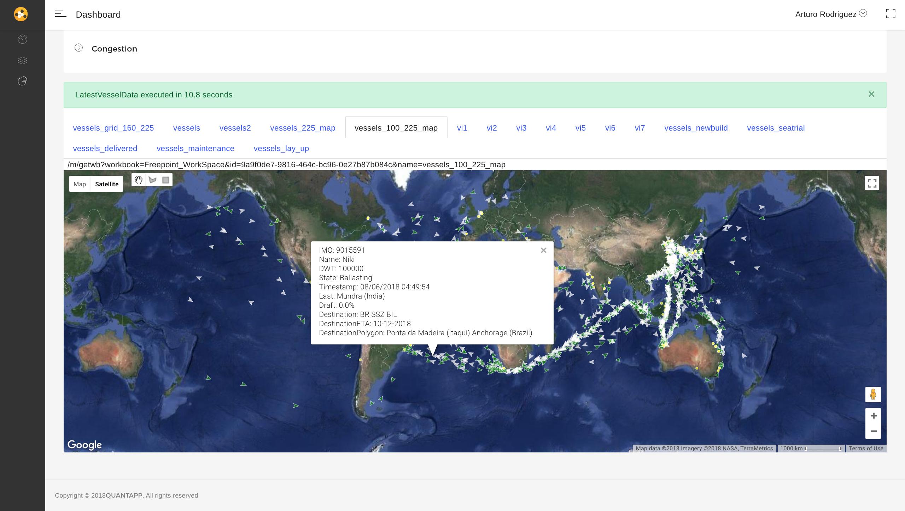
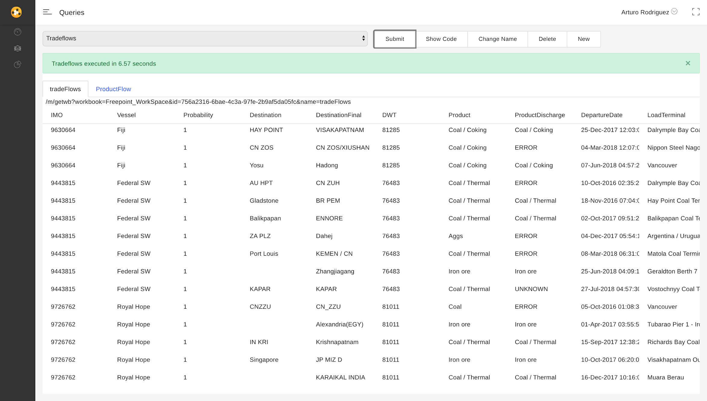
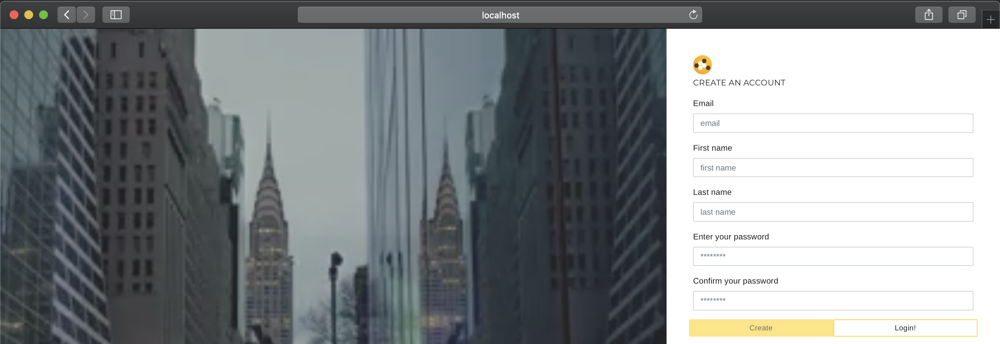
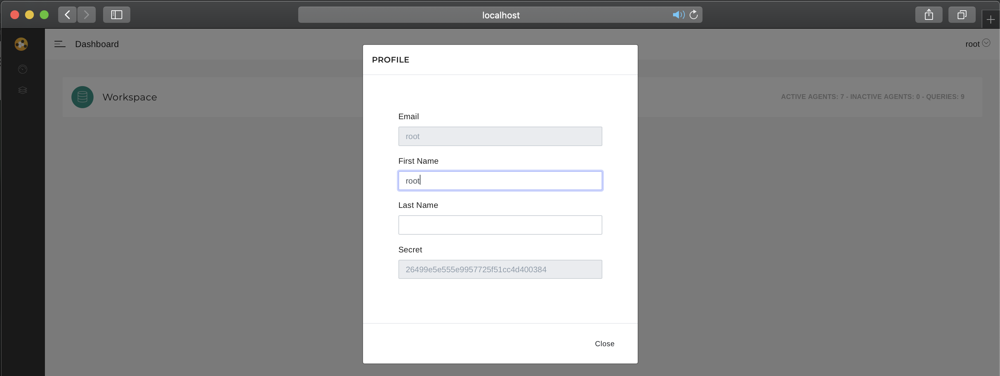

# CoFlows - Containerized Polyglot Runtime (Interop)

**CoFlows CE (Community Edition)** is a Containerized Polyglot Runtime that simplifies the development, hosting and deployment of powerful data-centric workflows. **CoFlows** enables developers to create rich **Web-APIs** with almost **zero boiler plate** and scheduled / reactive processes through a range of languages including CoreCLR (C#, F# and VB), JVM (Java and Scala), Python and Javascript. Furthermore, functions written in any of these languages can call each other within the same process with **full interop**.

As a Containerized Polyglot Runtime, its functionality allows developers to build complex workflows leveraging off great open-source libraries written in various languages. The wealth of distributed computing libraries of Java / Scala together with Python's data science tools are all available in order to use the right tool for the right purpose within the same process!

Furthermore, our aim with **CoFlows** is to offer simplicity for **Data Scientists** in order to quickly build self-contained projects while leveraging off popular tools. To this end, once a developer pulls the **CoFlows** image, a range of tools are at their disposal as first class citizens of the **CoFlows** ecosystem:
* DotNet Core 3.0
* Python 3.7.4
* Java 1.8
* Scala 2.11.8
* JupyterLab

Additionally, **CoFlows** offers great features including:
* Free and automatically generated SSL certificates through an integrated _LetsEncrypt_ functionality
* Integrated deployment to **Azure Container Instances**
* Integrated deployment from **GitHub** repositories
* Users and Permissions management
* Storage through either SQLite for local persistence or Microsoft SQL Server for cloud persistence. We will add more connectors in the near future.

... and yes, it is a big image taking 900Mb to download and 1.9Gb of space during runtime.

Our **Community Edition** is a version of our commercial codebase that we have used in various Data science projects including:
* Algorithmic Trading
* Vessel tracking and commodity trade flow projections
* Macro-economic risk management
* Global equity selection strategy simulations
* Healthcare cost and clinical segmentation analysis on national data

For more information visit https://www.coflows.com.

This edition will be tightly coupled with the **CoFlows Cloud** making it much easier for developers to deploy and host their applications. More information on this coming soon.

## Polygot
Let's start with a definition. According to Wikipedia, in computing, a polyglot is a computer program or script written in a valid form of multiple programming languages, which performs the same operations or output independent of the programming language used to compile or interpret it.

The QuantApp Engine enables a polyglot environment where developers can code their functions in a variety of languages while allowing all languages to co-exist in the same process in memory. This mitigates the need for a TCP (SOAP, JSON WebAPI, Py4J) overhead which is usual when functions from different languages interact.

Within a CoFlows workspace, three computing environments interact within the same process including the Core CLR (DotNet Core Language Runtime), JVM (Java Virtual Machine) and the Python interpreter. Javascript is interpreted within the CLR using the Jint package. Note: The CLR is the main execution environment which calls the JVM and and Python interpreter.

There are multiple sources pushing both the pros and cons of polyglot systems and this is not the place to discuss it. We believe that the ability to express algorithms in the correct language and using the best libraries for the right task is essential. **CoFlows** uses the **QuantApp.Engine** and **QuantApp.Kernel** libraries to offer interop between:
* CoreCLR: C#, F# & VB
* JVM: Java & Scala
* Python
* Javascript

### Notes
The Python link is achieved through a fork of the wonderful library [PythonNet](https://github.com/pythonnet/pythonnet "PythonNet").

The link between the **JVM** and **CLR** is achieved through the [QuantApp.Kernel/JVM](https://github.com/QuantApp/CoFlows-CE/tree/master/QuantApp.Kernel/JVM "QAJVM") libraries which have been developed from scratch for this project.

Javascript interpretation is achieved using the great [Jint](https://github.com/sebastienros/jint "Jint") library.

For further details please read [Polyglot](docs/Polyglot/General.md "Polyglot").

## Workspaces

Projects in **CoFlows** are called Workspaces. They contain the logic that defines the Web APIs and scheduled / reactive processes together with the definition of the entire environment including Nuget, Jar and Pip packages that the Workspace depends on. For further information please read [sample repo from GitHub](https://github.com/QuantApp/CoFlows-Workspace).

## Security, Authentication and Permissions

**CoFlows** has integrated LetsEncrypt functionality to simply the process to enable encrypted SSL connections. The standard process is to purchase an SSL certificate from CA, then transform the certificate into a PFX file which then should be stored securely while being accessible by the container. With LetsEncrypt, **CoFlows** now automatically generates a trusted SSL certificate if the domain name linked to the certificate is pointing to the container IP address. For more information please see the docs in the [sample repo from GitHub](https://github.com/QuantApp/CoFlows-Workspace).

### Authentication through username/password and Secret Keys
Authentication is done through **CoFlows** internal functionality. Users can either authenticate through the UI with a username and password. Alternatively, you can authenticate WebAPI calls using a secret key. This key can be accessed through the UI as explained below.

### Permissions
There are two types of  in **CoFlows** called Fixed and Group. First is the Fixed type which is hardcoded in the definition of the Workspace. Fixed permissions enable developers to give access to certain users prior to setting up Group permissions. You can think of these permissions as system permissions which should not be used for standard users but rather for system users.

Group permissions on the other hand are dynamic and related to groups. Groups are effectively sets of permissions that allow administrators to organize and control user access to internal features of the workspaces.

To manage user permissions you can create multiple groups and add users to these groups. For example, imagine you have a workspace with two types of users called Retail and Professional. Users added to these groups can have 1 of 4 possible permissions:
1) Denied (-1) - Explicit no access to this group, perhaps think of this as black list.
2) View (0) - Lowest level of access to this group. Perhaps users that are not paying for additional services but are having a free trial.
3) Read (1) - Mid level access, perhaps access to read information that is not accessible to (View only) users but no permission to change data.
4) Write (2) - Administrators or users with permissions to change data.

Please note that groups are arbitrary, you can create as many as you want. The meaning of the groups and their permissions are for you to define. To understand how to check if a user is a member of a group and see their permission please refer to the docs in the [sample repo from GitHub](https://github.com/QuantApp/CoFlows-Workspace).

## User Interface

To simplify your interaction with your **CoFlows** project, we have created a user interface. This UI has powerful visualization features that help you interact with dataset while you are designing them. For example, we worked on a GPS driven application where plotting points on a map was essential for correctly tuning the algorithms. This is a visual of this example

| Code |  Map |  Table |
:-------------------------:|:-------------------------:|:-------------------------: 
  |   |  

More on how to visualize this type of data in the docs of the [sample repo from GitHub](https://github.com/QuantApp/CoFlows-Workspace). Let's start with a few steps.

1) Clone the CoFlows-Workspace repo from [sample repo from GitHub](https://github.com/QuantApp/CoFlows-Workspace).

2) In the bin folder, execute the server.sh or bat/server.bat scripts. Read more in the README of this repo.

3) Open a browser and go to http://localhost and login with username "root" and password "123".

alternatively you could create a new user by clicking on "Create an account!"

4) Once logged in, you will see all the workspace hosted by this container. In this example, there is only one workspace called "Workspace". 

5) By click on the top right corner "root" you are able to logout, change password and see the user profile. In the user profile, you are able to change first and last names and most importantly see the User Secret. This Secret is used to authenticate user permissions when connecting through a WebAPI. 

6) Closing the profile window and going back to the dashboard you can click on the Workspace to enter it. This first view will let you see the Agents and Queries available in the workspace. This view also has multiple tabs which are discussed below.

7) The Source tab lets you browse the Base code of workspace. The base code can be thought of as libraries used by both Agents and Queries. For more information please see the documentation of the [sample repo from GitHub](https://github.com/QuantApp/CoFlows-Workspace). Please note that this code is read-only. To edit these libraries, you must do so outside of this UI.

8) View the permissions for this Workspace. As stated above, Fixed permissions are readonly and cannot be changed in the UI. The Group permissions are managed in the block below.

9) To add a user to a Group you need to specify their email. The user must have an account on this container with the same email you specify.

10) Groups can be added easily too.

11) Changing which group you want to manage can be done through select box like so. The Master group is the group for the entire Workspace. All users in the Workspace must be added to this group. Users can only be added to the "sub" groups once they are part of the master group.

## License 
The MIT License (MIT)
Copyright (c) Arturo Rodriguez All rights reserved.
Permission is hereby granted, free of charge, to any person obtaining a copy of this software and associated documentation files (the "Software"), to deal in the Software without restriction, including without limitation the rights to use, copy, modify, merge, publish, distribute, sublicense, and/or sell copies of the Software, and to permit persons to whom the Software is furnished to do so, subject to the following conditions:
The above copyright notice and this permission notice shall be included in all copies or substantial portions of the Software.
THE SOFTWARE IS PROVIDED "AS IS", WITHOUT WARRANTY OF ANY KIND, EXPRESS OR IMPLIED, INCLUDING BUT NOT LIMITED TO THE WARRANTIES OF MERCHANTABILITY, FITNESS FOR A PARTICULAR PURPOSE AND NONINFRINGEMENT. IN NO EVENT SHALL THE AUTHORS OR COPYRIGHT HOLDERS BE LIABLE FOR ANY CLAIM, DAMAGES OR OTHER LIABILITY, WHETHER IN AN ACTION OF CONTRACT, TORT OR OTHERWISE, ARISING FROM, OUT OF OR IN CONNECTION WITH THE SOFTWARE OR THE USE OR OTHER DEALINGS IN THE SOFTWARE.